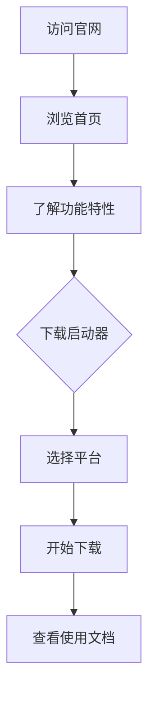

## 1. 产品概述
Craft Launcher 官网是 Minecraft 启动器的官方展示网站，旨在向用户介绍产品功能、提供下载入口、展示更新日志和社区资源。
- 目标用户：Minecraft 玩家、模组开发者、服务器管理员
- 市场价值：建立品牌形象，提供便捷的下载和支持渠道，增强用户粘性

## 2. 核心功能

### 2.1 用户角色
| 角色 | 核心权限 |
|------|----------|
| 普通用户 | 浏览网站、下载启动器、查看文档 |
| 管理员 | 管理下载链接、更新内容（后台） |

### 2.2 功能模块
1. **首页**：Hero Banner、核心特性展示、快速下载入口
2. **功能页面**：详细功能介绍、技术优势
3. **下载页面**：多平台下载、版本历史
4. **文档页面**：使用指南、API 文档
5. **关于页面**：团队介绍、联系方式

### 2.3 页面详情
| 页面名称 | 模块名称 | 功能描述 |
|----------|----------|----------|
| 首页 | Hero Banner | 动态背景、品牌宣传语、主要行动按钮 |
| 首页 | 特性展示 | 网格布局展示核心功能，悬停动效 |
| 首页 | 下载区域 | 多平台下载按钮，版本号显示 |
| 首页 | 更新日志 | 最近版本更新摘要 |
| 下载页面 | 版本列表 | 历史版本下载链接 |
| 下载页面 | 系统要求 | 各平台最低配置要求 |
| 文档页面 | 使用指南 | 安装、配置、启动教程 |

## 3. 核心流程
用户访问官网 → 浏览首页了解产品 → 点击下载按钮获取启动器 → 查看文档了解使用方法

## 4. 用户界面设计

### 4.1 设计风格
- **主色调**：紫色系（#4b3fe3）搭配深灰色背景，体现科技感和游戏氛围
- **辅助色**：绿色（#15a877）用于成功状态，蓝色（#2f74ff）用于信息提示
- **按钮样式**：圆角、渐变填充、悬停缩放效果
- **字体**：SF Pro / PingFang SC，标题使用粗体，正文使用常规字重
- **布局**：现代卡片式布局，大量留白，层次分明

### 4.2 页面设计概览
| 页面名称 | 模块名称 | UI 元素 |
|----------|----------|---------|
| 首页 | Hero Banner | 全屏背景、渐变遮罩、居中标题、CTA 按钮 |
| 首页 | 特性卡片 | 方形卡片、图标、标题、描述、悬停上浮 |
| 首页 | 下载区域 | 平台选择标签、下载按钮、版本号 |
| 下载页 | 版本列表 | 时间线样式、版本号、更新日期、下载按钮 |

### 4.3 响应式设计
- 桌面端优先设计（1280px+）
- 平板端自适应（768px-1279px）
- 移动端单列布局（<768px）

### 4.4 动效设计
- 页面加载时元素淡入上浮动画
- 卡片悬停缩放和阴影效果
- 按钮点击反馈动画
- 滚动时导航栏样式变化