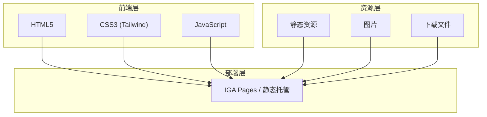
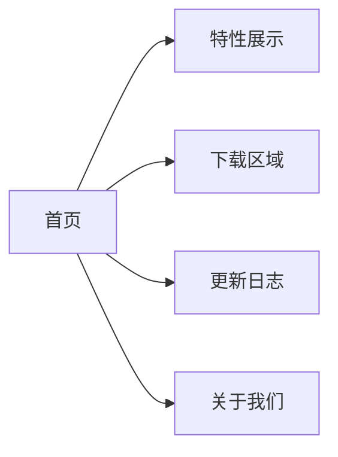

## 1. 架构设计


## 2. 技术描述
- **前端**: 纯 HTML + CSS + JavaScript（单页面应用）
- **样式**: Tailwind CSS 4.3.1（CDN 引入）
- **图标**: Lucide Icons（CDN 引入）
- **构建工具**: 无需构建工具，直接部署静态文件

## 3. 路由定义
| 路由 | 用途 |
|------|------|
| / | 首页 - Hero Banner、特性展示、下载入口 |
| /#features | 功能特性部分 |
| /#download | 下载区域 |
| /#changelog | 更新日志 |
| /#about | 关于我们 |

## 4. 页面结构


## 5. 组件划分
- **Header**: 导航栏、Logo、菜单
- **Hero**: 全屏 Banner、主标题、CTA 按钮
- **Features**: 特性卡片网格
- **Download**: 多平台下载按钮
- **Changelog**: 更新日志时间线
- **Footer**: 页脚、版权信息、链接

## 6. 数据模型（模拟数据）
### 6.1 特性数据
```json
{
  "features": [
    {"id": 1, "title": "快速启动", "description": "一键启动游戏，无需复杂配置", "icon": "play"},
    {"id": 2, "title": "模组管理", "description": "智能模组下载与管理", "icon": "puzzle"},
    {"id": 3, "title": "版本切换", "description": "支持多版本快速切换", "icon": "layers"},
    {"id": 4, "title": "自动更新", "description": "自动检测并更新游戏版本", "icon": "refresh-cw"}
  ]
}
```

### 6.2 版本数据
```json
{
  "versions": [
    {"version": "v2.4.1", "date": "2026-07-10", "changelog": "新增下载引擎优化"},
    {"version": "v2.4.0", "date": "2026-06-15", "changelog": "全新界面设计"}
  ]
}
```

### 6.3 下载数据
```json
{
  "downloads": [
    {"platform": "Windows", "file": "CraftLauncher_Setup.exe", "size": "45MB"},
    {"platform": "macOS", "file": "CraftLauncher.dmg", "size": "52MB"},
    {"platform": "Linux", "file": "CraftLauncher.AppImage", "size": "48MB"}
  ]
}
```